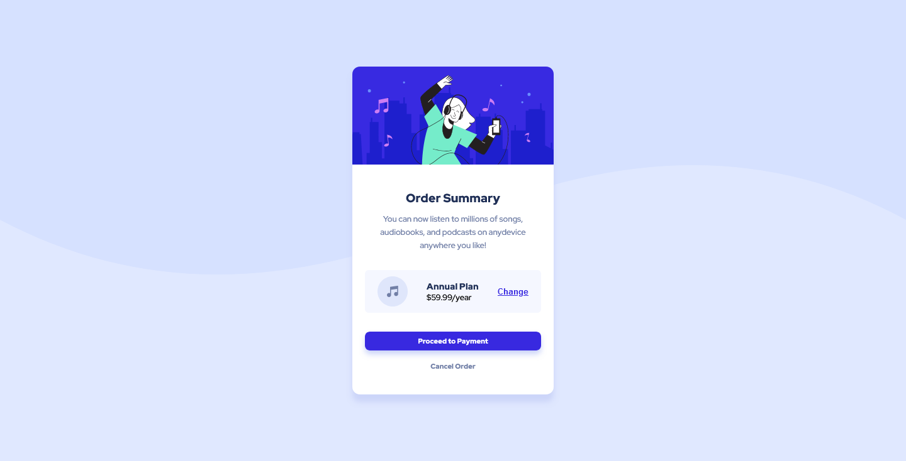

### Screenshot



### Built with

- Semantic HTML5 markup
- CSS custom properties
- Flexbox
- CSS Grid

### What I learned
In this challenge , i have learnt how to use filter and found this is easier than box shawdow .Also, It has many usecases
which is new to me.

```css
.card{
   filter:drop-shadow(0px 12px 4px hsl(228, 78.9%, 88.8%));
}
```
### Continued development
Still as usual I'm more focusing on responsive layout. But this time ,i more focusing on animation & javascript part.
